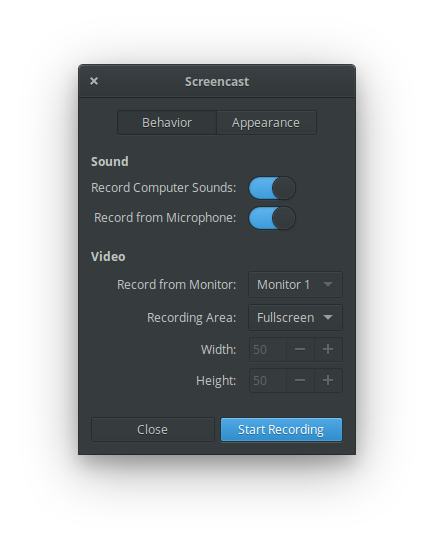

  <h1 align="center">Screencast</h1>
  <h3 align="center">A simple screencast recorder designed for [elementary OS]</h3>
  
Designed for <a href="https://elementary.io">elementary OS

### Donate
<a href="https://www.paypal.me/ArtemAnufrij">PayPal</a> | <a href="https://liberapay.com/Artem/donate">LibrePay</a> | <a href="https://www.patreon.com/ArtemAnufrij">Pareon</a>

  

  

Screencast is a fork of Eidete created by Sergey "Shnatsel" Davidoff

