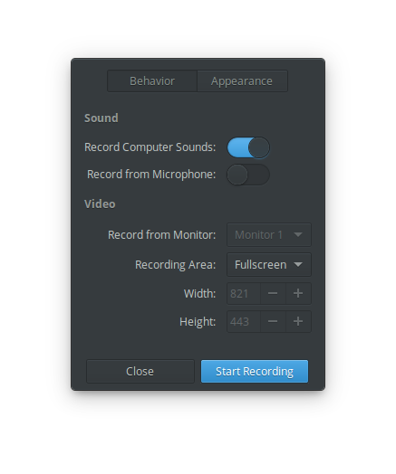
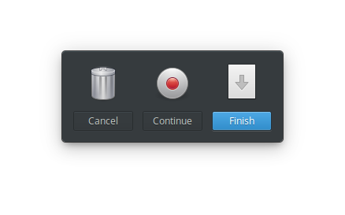

<div>
  <h1 align="center">Screencast</h1>
  <h3 align="center"><br>A simple screencast recorder designed for [elementary OS]</h3>
  <p align="center">Designed for <a href="https://elementary.io">elementary OS</p>
</div>

[](https://travis-ci.org/artemanufrij/screencast)

### Donate
<a href="https://www.paypal.me/ArtemAnufrij">PayPal</a> | <a href="https://liberapay.com/Artem/donate">LiberaPay</a> | <a href="https://www.patreon.com/ArtemAnufrij">Patreon</a>

<p align="center">
  <a href="https://appcenter.elementary.io/com.github.artemanufrij.screencast">
    
  </a>
</p>
<p align="center">
  <br/>
  
</p>
<p>Screencast is a fork of Eidete created by Sergey "Shnatsel" Davidoff</p>

## Install from Github.

As first you need elementary SDK
```
sudo apt install elementary-sdk
```

Install dependencies
```
sudo apt install libgstreamer1.0-dev libgstreamer-plugins-bad1.0-dev libwnck-3-dev libappindicator3-dev
```

Clone repository and change directory
```
git clone https://github.com/artemanufrij/screencast.git
cd screencast
```

Create **build** folder, compile and start application
```
mkdir build
cd build
cmake -DCMAKE_INSTALL_PREFIX=/usr ..
make
```

Install and start Screencast on your system
```
sudo make install
com.github.artemanufrij.screencast
```
